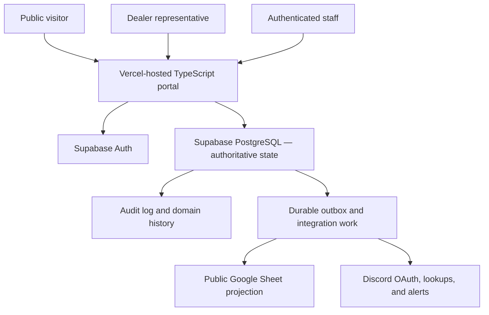
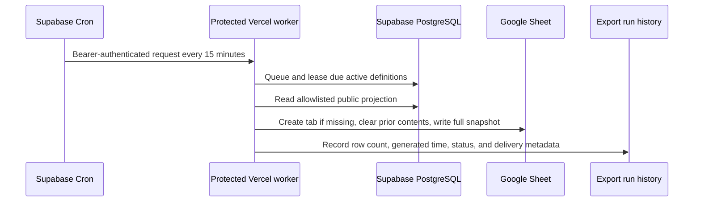

# East Empire Company Trade Registry — Complete User Guide

Status: Production operator guide  
Last revised: 2026-09-01
Production portal: <https://eec-trade-registry-portal.vercel.app>  
Public registry Sheet: <https://docs.google.com/spreadsheets/d/13bJeSAUF52cQnudC_l0JNOlKmcYY0wRWIq8OVqiEdrc/edit>  
Institutional time zone: `America/New_York`  
Configured currency: `SEP` (Septims, zero decimal places)

## 1. Purpose of this guide

This guide explains how to use the implemented East Empire Company trade registry as a public visitor, business representative, Agent, or Owner. It also explains what each operation changes, what it deliberately does not change, how the public Google Sheet is connected, and how to diagnose routine problems.

## Fastest routine administration

Use **Products** to add or edit something the Company trades. Adding a product asks only for its name, category, unit, supply workflow, and whether customers should see it. Stable codes, the public URL, and routine audit wording are generated automatically.

Use **Stock & prices** to check quantities, add ordinary finished stock, and edit the normal selling or guaranteed buying price beside an item. Use **Record activity** to save aggregate player-material purchases or enter a physically counted stock total. These actions still post balanced immutable ledger records; no editable stock cell exists.

Use **Company setup** only when the registry needs a new reusable category, unit, license type, endorsement, availability message, or control profile. It is not a product, stock, or pricing desk.

For a plain-language, roleplay-first explanation built around a public customer, licensed business, EEC agent, and warehouse handoff, start with the [Player and Discord Admin Handbook](PLAYER_ADMIN_HANDBOOK.md).

The governing rule for every workflow is:

> Supabase PostgreSQL is the only authoritative source of business data.

The portal reads and changes Supabase records through approved projections and secure commands. Google Sheets, Discord messages, exports, and future generated documents are outputs of those records. They are never substitute databases.

### Guide navigation

- Sections 2–4: architecture, core concepts, login, and roles
- Sections 5–6: public catalogue and verification
- Section 7: the complete field-by-field guide to adding items, stock, configuration, dealers, licenses, and staff access
- Sections 8–10: catalogue, dealer, and licensing administration
- Sections 11–19: orders, inventory, reservations, fulfillment, transfers, consignment, assets, and compliance
- Sections 20–23: access administration, operations, Google Sheets, and Discord
- Sections 24–28: daily routine, examples, troubleshooting, safety, and implementation boundaries
- Section 29: governing product and engineering documents

## 2. System at a glance



The portal has four simple access classes:

| Access class | Authentication | Main capabilities |
|---|---|---|
| Public | None | Browse the catalogue and verify exact dealer or license references |
| Business | Active license number plus a private access code issued by an Owner | View that exact business, shop, submit and inspect orders, cancel eligible orders, and report consignment observations |
| Agent | Discord OAuth plus an owner-approved Agent assignment | Perform day-to-day EEC trade, licensing, inventory, dealer, finance, and compliance work |
| Owner | Discord OAuth plus protected Owner authority | Everything an Agent can do, plus staff access approval, restricted audit, and platform administration |

Authentication and authority are separate. A successful login identifies an actor. It does not grant business permission by itself.

## 3. Core concepts every operator must understand

### 3.1 One authoritative database

If information differs between the portal, Sheet, Discord, or a copied document, Supabase is authoritative. Operators should investigate the source record and integration history rather than editing an output to make it look correct.

### 3.2 Secure commands, not direct edits

Consequential actions run through database or secure server functions. These functions re-read current state, confirm the actor's permission and scope, validate the transition, write history and audit evidence, and create integration work in one transaction.

The browser does not authoritatively calculate:

- Inventory balances
- Available stock
- Reservation capacity
- Order approval authority
- Price overrides
- License or endorsement eligibility
- Custody transfers
- Compliance effects

### 3.3 Effective dates

Dealer authority, licenses, endorsements, staff assignments, publications, and similar records may have start and end times. A record can exist while no longer conferring current authority.

### 3.4 Versioned records

Many staff forms carry an expected record version. If another operator changes the record before the first operator submits, the stale submission is rejected instead of overwriting newer work. Refresh the record, review the new state, and submit a new decision.

### 3.5 Idempotency

Retryable commands use request identifiers or unique constraints so a network retry does not duplicate an order, stock movement, fulfillment, transfer, notification, or export.

### 3.6 Append-only evidence

Posted inventory movements, domain events, and audits are not rewritten. Corrections use an explicit reversal, corrective transaction, superseding version, reopening, or later status event.

## 4. Access and roles

### 4.1 Staff sign-in

1. Open <https://eec-trade-registry-portal.vercel.app/staff/login>.
2. Select **Continue with Discord**.
3. Approve the Discord OAuth request when prompted.
4. Supabase exchanges the one-time authorization code and creates the portal session.
5. On a first login, the portal creates a **pending access request** and shows the user a waiting page. This is visible to the Owner at `/staff/access` but grants no staff data.
6. The Owner compares the immutable Discord ID with the known server member and approves as Agent, denies, or blocks the request with a reason.
7. After approval, the Agent signs in normally and lands on `/staff/dashboard`.

Discord server roles, display names, and bot permissions do not grant EEC business authority. Staff authority comes from effective-dated database assignments.

If Discord sign-in succeeds and shows **Owner approval is pending**, the login worked correctly; the Owner still needs to decide the request. If an approved Agent later sees a denied desk, refresh the access roster and confirm the Agent is still active.

### 4.2 Dealer sign-in

Dealer access begins at <https://eec-trade-registry-portal.vercel.app/dealer/login>.

A dealer session must satisfy all of the following:

- Valid Supabase Auth session
- Actor profile linked to that authenticated user
- Active representative relationship to the organization
- Required representative scope, such as `portal.read` or `order.create`
- Current authority-conferring dealer authorization

Dealer access is organization-scoped. An inaccessible order or party uses safe not-found behavior rather than revealing that another dealer's record exists.

### 4.3 Implemented staff role bundles

Roles are composable. One person may hold several roles.

| Role | Primary purpose |
|---|---|
| Platform administrator | Manage effective-dated staff assignments, no-code reference configuration, and operational health |
| Catalogue manager | Maintain canonical items, public presentations, and explicit price rules within granted permissions |
| Dealer registry officer | Onboard dealers and manage authorization lifecycle |
| Licensing officer | Issue licenses, change license status, and manage endorsements |
| Order officer | Review, approve, price, await stock, deny, or cancel orders |
| Warehouse operator | Receive stock, manage routine reservations and fulfillment, and perform scoped transfer work |
| Inventory controller | Includes elevated reversals, transfer authorization, asset lifecycle, and broader custody controls |
| Procurement officer | Register suppliers, receive player-sourced deliveries, and record payment evidence |
| Economic steward | Configure supply policy, reserve thresholds, and guaranteed purchase offers; monitor economic pressure |
| Compliance officer | Manage cases, inspections, evidence metadata, findings, record-only actions, and appeals |
| Integration operator | Configure non-secret destinations, schedules, manual exports, and delivery replay |
| Auditor | Read approved private history without mutation authority |

Platform administration does not automatically grant licensing, order, warehouse, compliance, or integration powers. Domain roles remain separate so an administrator cannot perform unrelated business actions merely because they manage access.

## 5. Public catalogue

Open <https://eec-trade-registry-portal.vercel.app/>.

The public catalogue can show:

- Item code and public name
- Public description
- Category, unit, and tags
- Configured control label
- Coarse availability wording
- Public price when configured
- Currency
- Minimum order and increment
- Plain-language requirements
- Publication and generation metadata

Catalogue publication is separate from stock and eligibility. A visible item may be awaiting stock, require a license, require staff review, or have no current price.

The public interface does not expose exact warehouse stock, private price schedules, acquisition cost, internal notes, unpublished controls, or serialized-asset custody.

### Public price interpretation

- A displayed price is a public projection, not a final order settlement.
- A blank price means pending or unavailable, never zero.
- Submitted order lines preserve a price snapshot when a price exists.
- Staff may set or change an order price only with the required permission and reason.

## 6. Public verification

Open <https://eec-trade-registry-portal.vercel.app/verify>.

### 6.1 Verify a dealer

1. Select **Dealer authorization**.
2. Enter the exact public dealer reference.
3. Submit the lookup.

An approved response may show the public name, dealer type, jurisdiction, public premises, authorization status, effective dates, related public licenses, and public notice.

### 6.2 Verify a license

1. Select **License**.
2. Enter the exact public license reference.
3. Submit the lookup.

An approved response may show the holder, class, jurisdiction, status, effective dates, endorsements, public conditions, and public notice.

### 6.3 Privacy behavior

Unknown, malformed, private, unpublished, and otherwise non-verifiable records share the same general miss contract. The public lookup does not disclose private contacts, applications, internal standing, staff notes, allegations, investigations, orders, or credentials.

The demonstration references currently visible in the seeded environment are:

- Dealer: `DLR-DEMO-A7K9`
- License: `LIC-DEMO-4Q2M`

They are fictional demonstration records and should be replaced or supplemented with approved operational data before a public launch announcement.

## 7. Complete guide to adding things

This is the practical starting point for administrators. The word **add** has a different meaning depending on what is being added. Choosing the correct record and desk is what keeps the platform faster and more reliable than a large spreadsheet.

### 7.1 First decide what you are adding

| You want to add | Correct record | Where to do it | What it does not do |
|---|---|---|---|
| A kind of product, such as tailoring goods | Item category | `/staff/configuration` | Does not create an item, license rule, price, or stock |
| A way of counting goods, such as garment, crate, or unit | Unit of measure | `/staff/configuration` | Does not add inventory |
| A product or material players can refer to | Catalogue item plus supply policy | `/staff/configuration` | Does not necessarily publish, price, or stock it unless those options are selected |
| More ordinary physical stock | Inventory receipt | **Manage** on the item in `/staff/inventory` | Does not create a new item and does not edit a stock cell |
| Player-produced keystone material | Supplier delivery | **Manage** on the material in `/staff/inventory` | Does not make the supplier a dealer or license holder |
| One unique controlled object | Serialized asset | `/staff/assets` | Does not add a fungible quantity |
| A business allowed to deal with EEC | Party plus dealer authorization | `/staff/dealers/new` | Does not issue a license or create login credentials |
| A legal or commercial authority type | License type | `/staff/configuration` | Does not issue that license to anyone |
| A modular permission carried by licenses | Endorsement definition | `/staff/configuration` | Does not grant the endorsement to a license |
| An actual license held by a party | License record | `/staff/licensing/new` | Does not create dealer authority or staff access |
| An endorsement on an existing license | Effective-dated endorsement grant | The license detail page | Does not rewrite the license class |
| A normal base selling price | Effective-dated price rule | **Manage** on the item in `/staff/inventory` | Does not settle an order price retroactively |
| Access for an EEC Agent | Owner-approved Agent assignment | `/staff/access` | Does not come from a Discord server role |
| A public or staff-facing status phrase | Availability profile | `/staff/configuration` | Does not calculate or change stock |
| A risk and review behavior | Control profile | `/staff/configuration` | Does not automatically define a specific license or endorsement requirement |

The most important distinction is:

```text
Item record != physical stock != public listing != price != license authority
```

Those records can be created together where the quick workflow supports it, but they remain separate facts with separate history.

### 7.2 The 30-second ordinary item workflow

Use this for routine fungible goods such as a normal garment, tool, component, food item, or ordinary warehouse material.

Open **Products** and select **Add product**.

For the shortest safe setup:

1. Enter **Product name** and an optional short description.
2. Select **Category**.
3. Select how it is measured.
4. Choose how the Company normally gets it.
5. Leave **Show it in the public shop** checked when customers should see it.
6. Select **Add product**.

The system can generate:

- A stable `ITM-####` item code
- A unique public URL slug based on the name
- A description based on the name
- Default public purchase wording
- A traceable audit reason
- A unique request identifier that prevents retry duplication

Use the generated values for ordinary work. Stock and prices are deliberately handled afterward in **Stock & prices**, where the product is already visible as one row.

### 7.3 How to choose the supply workflow

The supply workflow is a behavioral preset. It is not merely a public label.

| Supply workflow | Use it when | Inventory type | Ordinary receipt allowed? | Important consequence |
|---|---|---:|---:|---|
| **Warehouse stocked** | EEC receives and holds ordinary quantities | Fungible | Yes | Stock exists only after a receipt posts |
| **Player-sourced reserve** | EEC reserves must come from player suppliers | Fungible | No | Record purchases in **Record activity**; an incidental seller name is not required |
| **Made to order** | Demand may be accepted before goods are produced | Fungible | Yes | The order can wait for stock; selecting this does not create infinite physical stock |
| **Limited release** | EEC wants an auditable finite release | Fungible | Yes | Scarcity comes from real receipts and reservations, not a typed stock number |
| **Serialized unique item** | Each object needs its own identity and custody history | Serialized | No | Register individual assets on `/staff/assets`; never receive it as a generic quantity |

If the wrong workflow is chosen, do not work around it with a misleading receipt. Stop and use the approved correction path. Supply behavior controls which later commands are legal.

### 7.4 What happens when **Add product** succeeds

One database transaction creates the parts needed for the selected workflow:

1. The canonical item.
2. Its supply policy.
3. Its public catalogue presentation when publication is selected.
4. Audit evidence for each consequential part.
5. An outbox event for projections and notifications.
6. An idempotency receipt so a retry cannot create a second item.

The operation is atomic. If the actor lacks a required permission or a configured choice is invalid, the entire onboarding rolls back.

The button does **not**:

- Issue a license
- Decide which business may buy the item
- Submit an order
- Reserve inventory
- Fulfill a sale
- Create a player supplier
- Create multiple serialized objects
- Guarantee that a published price will be the final settled order price

### 7.5 What to do next

- To add ordinary finished stock, open **Stock & prices** and enter the amount beside the product.
- To record a player-material purchase, open **Record activity → Bought materials**.
- To enter a physical total, open **Record activity → Set a stock total**.
- To set normal selling or buying prices, use the price cells in **Stock & prices**.
- To change its public wording, open the product from **Products** and use **What customers see**.
- To set rare reserve thresholds or bespoke rules, use the contextual specialist record only after policy is approved.

### 7.6 Worked setup: ordinary warehouse-stocked garment

Example: add a new **Blue Evening Coat**.

1. Open **Products → Add product**.
2. Enter `Blue Evening Coat` as the item name.
3. Select `Tailoring goods`.
4. Select `Garment`.
5. Select **Keep it in stock**.
6. Leave publication checked if the public description is ready.
7. Select **Add product**.
8. If 10 coats are physically present, open **Stock & prices** and enter `10` in the coat's **Add stock** cell.
9. Set its normal selling price in the same row when approved.

The item now exists once. If 10 were received, the ledger shows a balanced receipt. If no quantity was entered, stock remains zero even though the catalogue item exists.

### 7.7 Worked setup: player-sourced keystone material

Example: add **Moonstone Ore** as an economic floor material.

1. Add a suitable category or unit first if the required option does not already exist.
2. In **Products → Add product**, enter `Moonstone Ore`.
3. Choose the raw-material category and material unit.
4. Select **Buy it from players**.
5. Configure reserve thresholds only after the economic policy owner approves them.
6. Publish public wording if ready, but do **not** enter opening stock.
7. Create the item.
8. Open **Stock & prices** and enter the approved **Company pays** amount beside Moonstone Ore.
9. Record each aggregate purchase in **Record activity → Bought materials** using item, quantity, and date. No seller name is required.
10. Review the automatically tabulated spending and any unpriced purchases in **Company books**.

The material remains visible in Stock & prices, but the generic receipt is unavailable. The card uses the supplier-delivery command instead. This prevents an admin from quietly spawning the keystone reserve on the website.

### 7.8 Worked setup: made-to-order good with no initial stock

Example: a specialist dress may be ordered in any reasonable quantity but is produced after demand is accepted.

1. Create it with **Made to order**.
2. Publish it with `Made to order` or `Available by request` wording.
3. Leave opening stock blank unless real finished units already exist.
4. Allow the licensed business to submit an order even while stock is zero.
5. Staff approve or mark the line awaiting stock according to the current decision.
6. When production delivers finished units, post an ordinary receipt.
7. Reserve the required quantity.
8. Fulfill the order from the reservation.

Made to order permits demand before stock. It does not authorize a negative ledger balance and does not mean that fulfillment happened merely because an admin can spawn the game item later.

### 7.9 Worked setup: limited release or artificial scarcity

Use **Limited release** only when the institution actually intends to control a finite release.

1. Create the item with the limited-release supply workflow.
2. Publish limited-allocation wording.
3. Receive only the real approved release quantity.
4. Let orders record demand even when the release is exhausted if the current order policy permits it.
5. Reserve stock in approval order or under a later approved allocation policy.
6. Do not increase the release by directly editing a balance; post a new documented receipt if more units are legitimately authorized.

The site can support scarcity, but scarcity remains a policy choice backed by ledger evidence. It is not automatically desirable for every item.

### 7.10 Worked setup: unique or individually controlled good

1. Create the catalogue item with **Serialized unique item**.
2. Choose a control profile requiring serialized tracking.
3. Publish only the public description appropriate for a unique good.
4. Do not enter opening quantity and do not use the ordinary receipt form.
5. Open `/staff/assets`.
6. Register each actual object separately so it receives an `EEC-AST` identity.
7. Record its accepted custody, inspections, condition, allocation, and lifecycle through asset events.

The catalogue item describes the type. Each asset record represents one real controlled object.

### 7.11 Add stock or change prices from one item card

Open **Stock & prices** at `/staff/inventory`.

1. Search for the item by name.
2. Read its available quantity, base selling price, and Company buying price when applicable.
3. Select **Manage**.
4. For an ordinary good, enter quantity and select **Add**.
5. For a player-sourced material, select the seller, enter quantity, and select **Buy & add**. If the price or first seller is missing, the same card asks for that one prerequisite first.
6. To change a normal price, enter the replacement under **Base selling price** or **Company buying price** and select **Update**.

The system posts a balanced movement from an external source account into the selected warehouse account. The visible on-hand and available quantities are recalculated from the ledger and reservations.

New prices apply only to future transactions. Existing orders and player-purchase receipts keep their snapshotted amounts. Use Owner system records when provenance is unusual, a prior transaction must be reversed, or an exceptional location needs review.

Never use an ordinary receipt for:

- A player-sourced-only reserve
- A serialized unique asset
- A quantity that is not physically present
- A correction to an earlier posted error
- A future expected shipment

Expected shipments and orders are not stock. Corrections use linked reversals and new corrective entries.

### 7.12 Add a category

Use the **No-code vocabulary** form on `/staff/configuration`.

1. Select `Item category`.
2. Enter a stable lowercase code such as `cooked-foods`.
3. Enter the staff display name, such as `Cooked foods`.
4. Enter a concise description.
5. Choose a display order when ordering matters.
6. Add an audit note if useful.
7. Select **Add configuration option**.

A category helps people find and organize items. It does not decide stock behavior, control level, license requirement, or price.

### 7.13 Add a unit of measure

1. Select `Unit of measure`.
2. Enter a stable code such as `bottle`.
3. Enter a display name such as `Bottle`.
4. Enter the unit symbol if one is useful.
5. Set decimal places:
   - `0` for indivisible things such as garments or crates
   - A positive scale only when fractional quantities are genuinely allowed
6. Select **Add configuration option**.

Changing the label does not convert existing quantities. Choose the unit carefully before transactions begin.

### 7.14 Add a license type

1. Select `License type`.
2. Enter a stable code such as `artisan-trade`.
3. Enter the staff and optional public display names.
4. Describe the general authority represented by the class.
5. Select **Add configuration option**.

This creates a reusable definition. It does not issue the license, approve a dealer, automatically grant endorsements, or make any item purchasable.

### 7.15 Add an endorsement

1. Select `License endorsement`.
2. Enter a stable code such as `tailoring-and-textiles`.
3. Enter staff and public display names.
4. Describe the modular authority.
5. Select **Add configuration option**.

After the definition exists, a licensing officer can grant it to an actual license on the license detail page. The definition and the grant are deliberately separate.

### 7.16 Add availability wording

1. Select `Availability wording`.
2. Create a stable code and staff display name.
3. Put the public-facing explanation in the description field.
4. Set display order if needed.
5. Save it.

Availability wording is a deliberately coarse public communication layer. It must never be interpreted as an exact stock promise.

### 7.17 Add a control profile

Control profiles define generic behavior without hard-coding item names.

1. Enter a stable lowercase code.
2. Enter the staff display name.
3. Write the public explanation.
4. Select the relevant behavior flags:
   - **Require staff review** means the transaction should not be treated as routine self-service.
   - **Require transaction approval** means an authorized approval step is required.
   - **Require serialized tracking** means individual asset identity and custody apply.
5. Add an audit note when the behavior is not self-explanatory.
6. Select **Add control profile**.

A control profile does not by itself say “requires tailoring license” or “requires arcane endorsement.” Specific eligibility and policy-rule configuration remains a separate governed layer. Do not imply that the three checkboxes create a complete license matrix.

### 7.18 Publish, unpublish, or change an item's public terms

Open **Products**, select the item, and find **What customers see**.

1. Check or clear **Show this product in the public shop**.
2. Confirm the public name and description.
3. Select the control and availability profiles.
4. Write plain-language purchase requirements.
5. Set a positive bulk minimum when one exists.
6. Set the order increment, such as `1` garment or `10` material units.
7. Enter a useful audit note only when the commercial change needs explanation.
8. Select **Save public listing**.
9. Change the normal selling price separately in **Stock & prices**. Blank means unset, never free.

The previous public presentation and price remain in effective-dated history. Existing submitted order snapshots are not silently rewritten by a later catalogue edit.

### 7.19 Add a dealer business

Creating a business is not a configuration action.

1. Open `/staff/dealers/new`.
2. Create the party and initial dealer authorization together.
3. Enter public information only in public fields.
4. Keep internal operational commentary in private notes.
5. Enable public disclosure only when the dealer is ready to be verified.
6. Activate the authorization through the supported lifecycle when approved.

The dealer receives an immutable public reference. That reference identifies the EEC dealer relationship; it is not a password, license number, staff identity, or supplier number.

### 7.20 Add a license and endorsements to a business

1. Confirm the holder party already exists.
2. Open `/staff/licensing/new`.
3. Select the holder, configured license class, and jurisdiction.
4. Set the approved status and effective date.
5. Leave expiration blank when no duration policy has been approved.
6. Select initial endorsements if the form supports them.
7. Separate public notes from private notes.
8. Enable public verification only when appropriate.
9. Submit with a meaningful reason.
10. Use the license detail page for later status transitions or endorsement grants and revocations.

A dealer authorization proves that the organization may deal with EEC. A license proves the scope of trade it is presently authorized to conduct. Many workflows require both.

### 7.21 Add staff access

Discord OAuth answers “Which Discord account signed in?” It does not answer “What may this person do?”

1. Have the future Agent open `/staff/login` and complete **Continue with Discord** once.
2. They should stop at **Owner approval is pending**. They do not need to send you a Supabase UUID or use an email form.
3. As Owner, open `/staff/access` or select **Approve staff access** from the dashboard.
4. Find the pending person by both their displayed Discord name and immutable Discord ID. Confirm that ID with the known server member; do not approve a display-name guess.
5. Choose **Approve as Agent**, enter why they are trusted to act for the EEC, and record the decision. To refuse access, choose **Deny**; choose **Block** for an identity that must not be reconsidered through repeated sign-ins.
6. The database creates the staff actor and Agent assignment together. The new Agent can refresh or sign in again and use the dashboard.
7. To remove an approved Agent, find the approved request in the same workspace and choose **Block this identity** with a reason.

Changing a Discord server role does not create, expand, or revoke EEC authority. Business users are not approved here; an Owner enables the Business portal from the exact business record and gives the business its license number and a private access code.

### 7.22 Identifier cheat sheet

| Identifier | What it proves | What it does not prove |
|---|---|---|
| Item code | Which canonical good is being discussed | Stock, current price, or eligibility |
| Dealer reference | Which organization has the recorded dealer relationship | A specific license scope or login identity |
| License reference | Which effective-dated license record is being verified | Dealer status, stock, or a person's password |
| Supplier reference | Who delivered player-sourced goods | Dealer or license authority |
| Order reference | Which commercial requisition is being processed | Reservation or fulfillment by itself |
| Reservation reference | Which quantity is temporarily claimed | Physical issue or delivery completion |
| Inventory transaction reference | Which immutable stock movement posted | Commercial approval or payment |
| Serialized asset reference | Which individual controlled object is involved | Ownership transfer merely because it was allocated |
| Request/correlation identifier | Which command attempt produced the result | A public business reference |

Always hand work off using the correct reference. “The dress order” or “that miner” is not enough for a safe administrative handoff.

### 7.23 Common errors while adding records

| Message or symptom | Meaning | Correct response |
|---|---|---|
| Access denied | The signed-in actor lacks one of the permissions required by the selected compound operation | Remove options outside the actor's role or ask an authorized operator to perform that part |
| Duplicate | The stable code, slug, or another unique reference already exists | Search for the existing record; do not create a near-duplicate without a real business reason |
| Invalid input | A required value is blank, malformed, out of order, or incompatible with the selected workflow | Recheck codes, positive quantities, schedule/price pairing, and threshold order |
| Not found | The selected record is inactive, unavailable to the actor, excluded by supply policy, or entered with the wrong code | Use the suggestion list and confirm the correct desk |
| Conflict | Another operator changed the effective record first | Refresh, read the new state, and resubmit intentionally |
| Save failed | The command did not commit | Do not assume partial success; refresh and check the authoritative record before retrying |
| Player-sourced item absent from quick receipts | Working as designed | Use supplier delivery on `/staff/economy` |
| Serialized item absent from quick receipts | Working as designed | Register the object on `/staff/assets` |

### 7.24 What “under 30 seconds” actually means

The target applies to prepared routine work:

- Creating an ordinary item when category, unit, control, availability, and supply choice are already known
- Posting a normal receipt when the physical item, quantity, and location are known
- Creating a simple category, unit, license definition, endorsement definition, or availability phrase
- Replacing a known public price or publication setting

It does not mean that an operator should rush through:

- Restricted approval
- Player-supplier inspection and payment evidence
- Unique-asset custody
- Dealer or license due diligence
- Reversals and reconciliation
- Compliance findings
- An unresolved economic or legal policy decision

The portal removes repetitive typing and duplicate spreadsheet maintenance. It does not remove the evidence that makes a consequential transaction trustworthy.

## 8. Staff catalogue desk

Open <https://eec-trade-registry-portal.vercel.app/staff>.

### 8.1 Create an item

1. Open the new-item form.
2. Enter a stable item code.
3. Enter the internal and public presentation fields supported by the form.
4. Select configured category, unit, inventory mode, and control metadata.
5. Supply the audit reason where required.
6. Submit the command.

Creation makes one canonical item. It does not automatically create stock, a reservation, a license rule, or a dealer-specific copy.

### 8.2 Edit an item

1. Open the item detail/edit page.
2. Review the current version and status.
3. Change permitted metadata.
4. Explain the reason.
5. Submit.

A stale version is rejected. Item code and public slug remain stable under the current correction policy boundary.

### 8.3 Archive or restore

Archiving removes the item from current public use without deleting its history. Restoring is a separate reasoned command. Neither operation changes historical orders, ledger movements, or audits.

## 9. Dealer registry desk

Open <https://eec-trade-registry-portal.vercel.app/staff/dealers>.

The queue lists dealer records, current status, type, jurisdiction, public/private visibility, premises, and latest update.

### 9.1 Onboard a dealer

1. Select **Onboard dealer**.
2. Choose the party type. **Organization** is the production default.
3. Enter legal name, internal display name, and optional public display name.
4. Select a configured dealer type and jurisdiction.
5. Choose the initial authorization status.
6. Enter public premises and public notice information when appropriate.
7. Put restricted operational commentary in private notes, not public notes.
8. Enable public disclosure only when the record is ready for public verification and export.
9. Enter the audit reason.
10. Submit.

The party and initial dealer authorization are created atomically. A failure creates neither record.

### 9.2 Maintain a dealer

Open **Review dealer** from the queue. Depending on current state and permission, staff can:

- Update public and private detail
- Activate the authorization
- Suspend it
- Reinstate it
- Revoke it
- Change public-disclosure status

Every lifecycle command requires an allowed source state, a current version where applicable, an authorized actor, and a reason. The previous record remains reconstructable through events and audit history.

Dealer authorization and licensing are separate. A dealer may require both a current dealer authorization and an appropriate license for a particular transaction.

## 10. Licensing office

Open <https://eec-trade-registry-portal.vercel.app/staff/licensing>.

### 10.1 Issue a license

1. Open the new-license form.
2. Select the existing holder party.
3. Select the configured license class and jurisdiction.
4. Choose the initial permitted status.
5. Set the effective date.
6. Leave expiration blank when no approved duration policy applies.
7. Select initial endorsements where appropriate.
8. Enter public notes separately from private notes.
9. Enable public verification only when approved.
10. Enter a reason and submit.

The database allocates the immutable public reference and creates the license, initial status history, selected endorsements, audit evidence, and outbox event in one transaction.

### 10.2 Manage license status

The implemented lifecycle supports reasoned, permission-checked operations including:

- Activate
- Suspend
- Reinstate
- Revoke
- Record surrender

Revoked and surrendered states are terminal in the current model. Expiration behavior and grace periods remain policy-gated.

### 10.3 Manage endorsements

Endorsements are modular grants attached to a license. Granting or revoking one creates effective-dated history; it does not rewrite the license class or erase prior authority.

Public applications and renewal intake are active, and authorized Agents decide them in `/staff/applications`. Automatic expiration and free-form condition authoring remain policy-gated. Staff must not represent direct issuance as an application decision when no application record exists.

## 11. Dealer orders

Dealer representatives use:

- <https://eec-trade-registry-portal.vercel.app/dealer/orders>
- <https://eec-trade-registry-portal.vercel.app/dealer/orders/new>

### 11.1 Submit a requisition

1. Sign in as an authorized representative.
2. Select the represented organization when more than one is available.
3. Start a new order.
4. Add item and quantity lines.
5. Select the supported fulfillment mode and provide required context.
6. Submit.

Submission validates the representative grant, current dealer authorization, optional license, published items, positive quantities, and configured control snapshots. It creates an `EEC-ORD` reference, order and line history, audit evidence, and an outbox event.

Submission deliberately does not:

- Reserve stock
- Move inventory
- Transfer title or custody
- Consume quota
- Promise a settled price

Orders may be submitted without stock on hand. Such demand can proceed to an awaiting-stock decision.

### 11.2 Dealer cancellation

A dealer with `order.cancel` scope may cancel an eligible order before reservation, ready, or fulfillment progress prevents cancellation. Fulfilled quantities are never retroactively cancelled.

## 12. Staff order desk

Open <https://eec-trade-registry-portal.vercel.app/staff/orders>.

### 12.1 Review an order

1. Open an order from the queue.
2. Review the dealer, authorization, optional license, fulfillment request, item control snapshots, requested quantities, price state, and order history.
3. Choose the supported decision for each line:
   - Full approval
   - Partial approval
   - Awaiting stock
   - Denial
4. Set an authorized price when appropriate, or leave it explicitly pending.
5. Enter the decision reason.
6. Submit.

The command selects the required ordinary, restricted, or unique approval permission from the stored line control snapshot. The database derives the resulting line and header states; the browser does not.

### 12.2 Important order rules

- Approval does not reduce warehouse stock.
- Awaiting stock preserves commercial demand.
- Partial approval is supported.
- Cancellation or denial cannot erase fulfilled history.
- A price override is a distinct authorized action, not a hidden browser calculation.
- Reservation and fulfillment remain separate warehouse steps.

## 13. Stock & prices

Open <https://eec-trade-registry-portal.vercel.app/staff/inventory>.

### 13.1 Understand the displayed quantities

For fungible stock:

```text
Posted physical on hand
- effective active reservations
= available quantity
```

No operator directly edits a `current stock` field. The displayed position is derived from immutable ledger entries and current reservation records.

### 13.2 Receive stock

1. Search for the item.
2. Select **Manage**.
3. Enter quantity under **Add stock**.
4. Select **Add** for an ordinary receipt or **Buy & add** for a player-supplied material.

The screen derives the routine location and provenance. The authoritative command still verifies the item, actor, warehouse scope, supply mode, seller and current offer as applicable. It then posts a balanced transaction into the physical warehouse account. Negative physical balances are forbidden.

### 13.3 Change normal prices

On the same item card:

- **Base selling price** is the configured normal base used by future sales and channel pricing rules.
- **Company buying price** is what EEC guarantees to pay a player supplier for that material.

They are separate because selling goods and purchasing reserve materials are separate transactions. Updating either creates a new effective record and preserves historical snapshots.

### 13.4 Correct a posted receipt

Do not edit or delete it. An inventory controller posts one linked reversal with a reason. If needed, post a separate corrected receipt afterward.

A reversal is rejected if it would make physical stock negative or reduce stock below effective reservations.

## 14. Reservations

Reservations are explicit time-bounded claims against approved order demand.

### 14.1 Create a reservation

1. Open the approved or awaiting-stock demand from the warehouse workflow.
2. Select the permitted warehouse stock account.
3. Enter a quantity that does not exceed remaining approved demand or available stock.
4. Create the reservation.

The default initial term is 48 hours. The database locks or otherwise serializes the relevant stock scope so two operators cannot claim the same final units.

### 14.2 Extend or release

Authorized staff may extend or release an active reservation with a reason. Expired reservations no longer reduce available stock. A consumed reservation remains historical and is never reactivated by a fulfillment reversal.

## 15. Fulfillment desk

Open <https://eec-trade-registry-portal.vercel.app/staff/fulfillment>.

### 15.1 Fulfill reserved stock

1. Locate an active, unexpired reservation.
2. Confirm the order line, warehouse, item, quantity, and collecting or receiving context.
3. Enter the reason or confirmation required by the form.
4. Complete fulfillment.

One transaction:

- Locks the relevant order, line, reservation, and physical account
- Marks the reservation consumed
- Posts the balanced physical-to-external inventory issue
- Increases fulfilled quantity
- Derives line and order status
- Writes audit and history
- Emits `fulfillment.completed`

### 15.2 Reverse a fulfillment

An inventory controller may post a linked reversal. This restores ledger stock and reopens outstanding demand while preserving the original fulfillment and consumed reservation as historical evidence.

## 16. Warehouse transfers

Open <https://eec-trade-registry-portal.vercel.app/staff/transfers>.

The implemented fungible transfer path uses:

```text
requested -> authorized -> dispatched -> received
                 |              |
                 |              +-> disputed
                 +-> cancelled before dispatch
```

### 16.1 Request

A warehouse operator selects source and destination warehouses, item, and full transfer quantity. The request creates no hidden destination stock.

### 16.2 Authorize

An inventory controller revalidates scope, stock, and current transfer version before authorization.

### 16.3 Dispatch

Dispatch posts stock from the source physical account into an explicit in-transit custody account.

### 16.4 Receive

Receipt posts the in-transit quantity into the destination physical account. A discrepancy remains explicitly in transit or disputed; it is not fabricated as received.

A dispatched transfer cannot be cancelled. Use the supported receipt, dispute, return, or later resolution workflow.

## 17. Consignment desk

Staff use <https://eec-trade-registry-portal.vercel.app/staff/consignments>. Dealer representatives use <https://eec-trade-registry-portal.vercel.app/dealer/consignments>.

Consignment separates ownership from custody:

```text
Owner: East Empire Company
Custodian: Authorized dealer
Stock state: Consigned
```

### 17.1 Create and maintain an agreement

Authorized staff can create an effective-dated agreement between the configured owner and a currently authorized dealer, then suspend, reactivate, or close it. Closing is blocked while ledger-backed custody remains outstanding.

Free-text terms are descriptive only. They do not implement commissions, settlement calculations, or liability rules.

### 17.2 Issue fungible stock

1. Select the active agreement.
2. Select an eligible item and available warehouse source account.
3. Enter the quantity and reason.
4. Post the issue.

The ledger moves custody from EEC physical stock to the dealer's consigned account while retaining the configured owner.

### 17.3 Dealer report

The representative reports sold, returned, lost, damaged, and observed-on-hand quantities. This is a claim and does not change inventory when submitted.

### 17.4 Staff acceptance

Ordinary acceptance requires exact reconciliation:

```text
prior outstanding custody
- reported sold
- reported returned
= observed on hand
```

Accepted sales move custody to an external account. Accepted returns move custody to a matching authorized warehouse account. Loss or damage cannot be accepted through the ordinary path because exception, liability, and settlement policy is unresolved.

## 18. Serialized assets

Open <https://eec-trade-registry-portal.vercel.app/staff/assets>.

Serialized items use individual `EEC-AST` asset identities and append-only events instead of fungible quantities.

Implemented staff operations include:

- Register an asset
- Allocate one asset to one approved unique order line
- Release or expire an allocation
- Transfer accepted custody
- Record an inspection
- Record condition or lifecycle events
- Mark missing and later recovered
- Record damage or seizure
- Retire or destroy under the permitted lifecycle

Ownership, custodian, warehouse, and location are separately represented. One asset cannot have two active allocations or two current accepted custodians.

Allocation does not move custody and is not fulfillment. Unique-asset fulfillment remains gated by transaction-specific approval and title-transfer policy.

## 19. Compliance desk

Open <https://eec-trade-registry-portal.vercel.app/staff/compliance>.

### 19.1 Open a case

1. Choose the configured case type and confidentiality.
2. Add the appropriate subject party and optional supported record link.
3. Write a neutral case summary.
4. Assign the case when appropriate.
5. Submit with a reason.

Opening a case is not a finding of wrongdoing.

### 19.2 Inspections, allegations, evidence, and findings

- Inspections record planned or completed evidence-gathering work.
- Allegations are separate immutable assertions.
- Evidence metadata records classification and reference; it does not expose a file or credential.
- Findings explicitly record `substantiated`, `not_substantiated`, or `inconclusive`.

### 19.3 Actions and appeals

The current action model is record-only. Staff can recommend, approve, decline, or void a configured action record, but `effect_applied` remains false. Recording a recommended suspension does not silently suspend a license, dealer, order, reservation, asset, or stock position.

An approved record-only action may receive one appeal. Staff can record an affirmed, varied, remanded, reversed, or withdrawn disposition. The appeal does not automatically stay or change another domain.

## 20. Access administration and operations

Open <https://eec-trade-registry-portal.vercel.app/staff/access> for people and <https://eec-trade-registry-portal.vercel.app/staff/operations> for system health.

### 20.1 Approve an Agent

1. Confirm the pending Discord ID with the known server person.
2. Choose **Approve as Agent**.
3. Enter a clear reason.
4. Submit once. A retry cannot create a duplicate Agent.

### 20.2 Deny or block access

**Deny** records that a pending request was refused without creating an actor or assignment. **Block** disables an approved Agent or prevents a refused identity from being approved accidentally. A deliberate later approval can reinstate a blocked Agent; it requires a new owner decision and reason. The protected Owner identity cannot be blocked from this Agent queue.

### 20.3 Health review

The operations console summarizes conditions such as:

- Failed or pending outbox work
- Failed exports and deliveries
- Expired worker leases
- Overdue definitions
- Expired reservations
- In-transit or disputed transfers
- Open compliance work
- Recent access audit evidence

The console identifies conditions; it does not silently rewrite authoritative records.

## 21. Integration console

Open <https://eec-trade-registry-portal.vercel.app/staff/integrations>.

An integration operator can:

- Inspect runtime readiness without seeing secret values
- Configure non-secret spreadsheet or Discord channel identifiers
- Activate or deactivate approved destinations
- Activate or deactivate approved export schedules
- Queue a manual public snapshot
- Inspect recent export and delivery attempts
- Replay eligible failed deliveries with an audit reason

An integration operator cannot query arbitrary tables, edit the export query from the browser, read service-account credentials, or change source business records.

## 22. Is the Google Sheet linked to the platform?

Yes. The production Sheet is actively linked as a one-way scheduled projection:

<https://docs.google.com/spreadsheets/d/13bJeSAUF52cQnudC_l0JNOlKmcYY0wRWIq8OVqiEdrc/edit>

It contains the managed tabs:

- `Catalogue`
- `Dealers`
- `Licenses`

The production connection was independently confirmed on 2026-08-10. The anonymous CSV endpoints returned HTTP 200, and all three tabs contained a new 07:30 UTC generation watermark.

### 22.1 Exact data flow



The worker currently refreshes every 15 minutes. Each run queries approved public projection functions, replaces the managed tab with raw values, and records the result.

### 22.2 Direction of authority

```text
Supabase -> Google Sheet
Google Sheet -X-> Supabase
```

The Sheet is not two-way. Manual cell edits are not imported and will normally be overwritten by a later full-tab replacement. Do not use the Sheet to approve, correct, or administer anything.

### 22.3 What makes the connection secure

- The database scheduler calls a protected worker route.
- The route uses a server-only bearer secret.
- Google service-account credentials remain in Vercel's managed server environment.
- Only the spreadsheet identifier is stored as ordinary destination configuration.
- The service account can write the approved spreadsheet, but the browser never receives its private key.
- The worker can read only allowlisted public export projections through its integration path.
- Export failures do not change business state.

### 22.4 How to confirm that the Sheet is current

1. Open the Sheet.
2. Check all three managed tabs.
3. Inspect the source and `Generated at` metadata in the top rows/columns.
4. Compare it with the schedule shown in `/staff/integrations`.
5. Confirm the corresponding recent runs are `delivered` and show the expected row counts.

Normal projection lag is up to the approved 15-minute cadence plus processing time.

### 22.5 If the Sheet appears stale

1. Open `/staff/integrations`.
2. Confirm **Worker authority**, **Worker secret**, **Supabase 15-minute job**, and **Google Sheets** report ready.
3. Confirm the destination and each export definition are active.
4. Review the last database trigger and next scheduled run.
5. Inspect failed or leased export runs and safe error codes.
6. Queue a manual snapshot with a meaningful audit reason if an immediate refresh is operationally required.
7. Recheck the generated timestamp and row count.
8. If credentials or access are the cause, rotate or repair them in the owning provider. Never paste credentials into a reason field, ticket, chat, or SQL snippet.

Do not repair a stale projection by manually editing the Sheet.

## 23. Discord status and behavior

Staff Discord OAuth login is active.

A new Discord login now creates an owner-visible pending request. If the private `staff-alerts` Discord destination and bot delivery are configured, the same database event may also produce a private alert. The website queue is the review surface; a Discord message or role never approves the request.

The application also contains signed public `/catalogue`, `/dealer`, and `/license` lookup handling and allowlisted staff-alert routing. Discord verifies requests with Ed25519 signatures, stale requests are rejected, and mentions are disabled.

Bot delivery and command registration remain inactive until the server-side bot token is installed and a private numeric staff-alert channel is configured. Discord messages, reactions, edits, and deletions never change EEC business state.

## 24. Recommended daily operating routine

### Opening review

1. Sign in through Discord.
2. If you are the Owner, open `/staff/access` and decide pending Discord identities.
3. Open `/staff/applications` and decide pending license applications relevant to your work.
4. Open `/staff/operations` and review failed outbox, delivery, and export counts.
5. Review expired leases, overdue definitions, reservations, and in-transit/disputed transfers.
6. Review open compliance work relevant to the operator's authority.
7. Open `/staff/integrations` and confirm the latest scheduled export cycle delivered.
8. Check the public Sheet generation timestamps.

### During operations

- Work from the appropriate queue rather than copied links or Sheet rows.
- Confirm party, item, warehouse, jurisdiction, and quantity before every consequential command.
- Give reasons that explain the business decision without including credentials or unnecessary restricted information.
- Refresh stale forms rather than trying to bypass version checks.
- Use reversals and corrective workflows instead of editing posted evidence.

### Closing review

1. Confirm no unexpected failed integrations or abandoned leases appeared.
2. Review open transfers and reservations created during the shift.
3. Confirm scheduled public exports still advance.
4. Hand off unresolved cases using source record references and request IDs, not screenshots as the authority.

## 25. End-to-end examples

### 25.1 Aurelion orders a Nocturnal Dress through a licensed business

This is the complete ordinary customer-to-business-to-EEC workflow.

#### Step 1: Aurelion browses

Aurelion Earandil opens the public catalogue and finds the Nocturnal Dress. The listing tells him the public description, public price if one is configured, coarse availability wording, and purchase requirements.

The listing does not promise exact stock or prove that Aurelion is personally eligible to use the wholesale channel.

#### Step 2: Aurelion chooses a business

Aurelion approaches a Solitude tailor that advertises EEC ordering service. Before paying a deposit, either party can use exact public references on `/verify` to check:

- The business's current dealer authorization
- The business's current license
- Relevant public endorsements
- Effective dates and jurisdiction

The dealer number answers “Is this business recognized by EEC?” The license number answers “What trade is the business authorized to conduct?” They are separate because a business relationship and a trade authority are not the same fact.

#### Step 3: The business agrees to serve the customer

The tailor and Aurelion agree on their own retail terms. The business may add an approved commission or retail margin under server policy. The current EEC platform does not calculate or settle that private retail agreement.

The business should record enough information in its own roleplay or Discord conversation to know what Aurelion wants, but Aurelion does not become the EEC wholesale ordering party.

#### Step 4: The verified business submits the EEC order

An Owner enables **Business portal** on the business record and privately supplies one access code. The business opens `/dealer/login` and enters:

- Its active `LIC` number
- Its private access code

No email or Discord login is needed. After sign-in, the business chooses **Shop** and submits:

- The represented business
- The exact catalogue item
- The quantity
- The supported fulfillment preference and context

The system creates an `EEC-ORD` reference and snapshots the business, license/control context, item, quantity, and any current price state.

An EEC Agent may also enter the same requisition from **New order** on behalf of the verified business. The business remains the ordering party in either path. Staff must not ask for or borrow the business access code.

#### Step 5: The EEC agent reviews the request

The agent opens `/staff/orders`, finds the `EEC-ORD` reference, and checks:

- The ordering business is the correct party
- Dealer authorization is current
- The license and endorsements satisfy the configured requirements
- The requested quantity and item are correct
- The control snapshot is ordinary, restricted, or unique
- The price is explicit or intentionally pending
- The decision is within the agent's permissions

The agent approves, partially approves, marks awaiting stock, or denies with a useful reason.

Approval records commercial authority. It does not remove a dress from inventory.

#### Step 6: Stock is allocated

If a dress is available, the warehouse creates a reservation for the approved order line. The reservation reduces **available** stock but does not yet reduce physical on-hand stock.

If no dress is available, the order remains awaiting stock. This is valid. The platform records demand without inventing inventory or forcing a negative balance.

For a made-to-order dress, finished stock can be received after production. For a limited release, the business waits until an actual unit is available under the approved allocation policy.

#### Step 7: Warehouse fulfillment

At collection or confirmed receipt, the warehouse operator opens `/staff/fulfillment` and confirms the active reservation, order, item, quantity, warehouse, and recipient context.

Completion performs one coupled transaction:

- Consumes the reservation
- Posts the physical inventory issue
- Increases fulfilled quantity
- Derives the line and order status
- Writes audit and history
- Queues configured notifications

The EEC wholesale transaction is now fulfilled to the licensed business.

#### Step 8: The business completes the retail transaction

The tailor gives or sells the dress to Aurelion under their separate agreement. The EEC history continues to show the licensed business as the ordering and receiving party. It does not pretend that Aurelion had a wholesale login or EEC license.

#### Step 9: Corrections and cancellations

- Before fulfillment progress, the authorized business may cancel an eligible order.
- A reservation must be released through the supported workflow; deleting a Discord message does nothing.
- A fulfilled stock mistake uses a linked reversal and corrected fulfillment, not history editing.
- A retail refund between Aurelion and the tailor is outside the current EEC wholesale settlement model.

### 25.2 New dealer to fulfilled wholesale order

1. Dealer registry officer onboards the organization.
2. The officer activates its dealer authorization when approved.
3. Licensing officer issues the appropriate license and endorsements.
4. A dealer actor receives an effective representative grant.
5. Catalogue manager ensures the desired item is published.
6. Warehouse operator posts the physical receipt.
7. Dealer representative submits the requisition.
8. Order officer approves all or part of the quantity and records price state.
9. Warehouse operator creates a reservation when stock is available.
10. Warehouse operator completes fulfillment.
11. Ledger, order, reservation, audit, and outbox history commit together at each step.
12. Public dealer/license projections appear in the next Sheet refresh when disclosure is enabled; private order and stock data do not.

### 25.3 Order submitted before stock arrives

1. Dealer submits an order while available stock is zero.
2. Order officer records `awaiting stock` rather than rejecting legitimate demand.
3. Warehouse operator later posts a receipt.
4. Authorized staff creates a reservation against the now-available quantity.
5. Fulfillment consumes that reservation and posts the issue.

No negative stock or fictional reservation is created while waiting.

### 25.4 Consignment sale report

1. Staff creates the agreement and issues 20 fungible units into dealer custody.
2. Dealer reports 5 sold, 3 returned, and 12 observed on hand.
3. Staff verifies `20 - 5 - 3 = 12`.
4. Acceptance posts the sale and return custody movements.
5. The remaining consigned position is 12.

If the dealer instead reports loss or damage, the report is preserved but ordinary acceptance is blocked pending the approved exception policy.

### 25.5 Player miner sells iron ore into the economic reserve

1. The economic steward confirms that Iron Ore is configured as a player-sourced reserve and publishes an approved effective-dated floor purchase offer.
2. A miner brings 100 units to an EEC agent.
3. A procurement officer finds or registers the miner as a supplier.
4. The officer inspects the delivery, selects the current Iron Ore offer, records 100 accepted units, and chooses the actual receiving location.
5. The database creates a procurement receipt, records the Company's obligation at the offer rate, and posts 100 units into the warehouse ledger.
6. The officer pays the miner through the approved server method.
7. Only after payment occurs, the officer records the voucher, ticket, Discord log, or other approved settlement reference.
8. The economy dashboard now reflects real reserve stock and recorded settlement state.
9. A smith may still trade directly with the miner. The EEC purchase floor exists as a guaranteed fallback, not a mandatory market price.

The supplier reference does not turn the miner into a dealer. The receipt does not invent funds or function as a complete treasury ledger.

### 25.6 Business needs a large quantity of keystone material

1. The business submits demand through the licensed ordering channel.
2. The order may be accepted even if current reserve stock is insufficient.
3. Staff review the business quantity, control, and any configured bulk-review threshold.
4. If enough stock exists, the warehouse reserves and fulfills it normally.
5. If reserves are short, the line waits for stock while the economy dashboard exposes unmet demand.
6. New player deliveries replenish the reserve through procurement, not generic admin receipts.
7. Any high convenience or emergency resale price must be entered as approved price data; the current system does not assume “double price” automatically.

This allows the EEC to stabilize material availability without pretending supply is infinite.

### 25.7 Direct individual premium purchase

1. The EEC agent opens **Orders → New order** (`/staff/orders/new`).
2. The agent chooses **Direct individual** and selects an existing customer or enters a new name, contact label, and region.
3. The agent chooses up to five goods and quantities. Only items explicitly enabled for direct purchase are accepted.
4. Supabase resolves the current public base price and applies the authoritative `3×` premium. The selected price schedule, rule, base amount, multiplier, final amount, and currency are frozen on the line.
5. Supabase locks the customer/item/week, totals current held or consumed quantity, and rejects a request that would exceed the item’s configured weekly personal limit.
6. Successful submission creates a quota **hold**. It becomes **consumed** when the line is fulfilled and **released** if the line is denied or cancelled.
7. Stock is not required at submission. Staff review, reserve, and fulfill the order through the same later workflow as other orders.

Do not use a dealer identity for an individual purchase, manually multiply a price, or track the weekly limit in Discord. Those are now database rules.

### 25.8 Complete launch setup for a new trade line

Suppose the server launches an alchemical trade line from nothing.

1. Platform administration creates any missing `Alchemical goods` category, units, license type, endorsements, availability wording, and control profiles.
2. Catalogue and economic staff agree which goods are warehouse stocked, player sourced, made to order, limited release, or serialized.
3. Catalogue staff quick-create each item with supply policy and public terms.
4. Economic staff configure reserve thresholds and floor offers only for player-sourced materials.
5. Warehouse staff receive real ordinary stock; procurement staff receive real supplier deliveries.
6. Dealer staff onboard approved alchemical businesses.
7. Licensing staff issue the correct license class and alchemical endorsements.
8. Administrators grant each operator only the required database role and scope.
9. Dealer representatives submit real test requisitions through their own credentials.
10. Order and warehouse staff exercise approval, awaiting-stock, reservation, fulfillment, reversal, and handoff procedures.
11. Integration staff confirm public catalogue, dealer, and license projections refresh in Google Sheets.
12. Discord admins publish public catalogue and verification instructions without treating Discord roles as EEC authority.
13. Operations staff verify failed-work queues, audit history, and provider readiness before announcing launch.

At no point is the Google Sheet used to create authoritative business state.

## 26. Error and troubleshooting guide

| Symptom | Likely cause | Correct response |
|---|---|---|
| Discord says sign-in was cancelled | The person rejected/closed the provider prompt, or Discord returned `access_denied` | Try again and approve the prompt; no session or authority was created |
| Discord sign-in could not be completed | Missing callback code, provider error, or OAuth redirect misconfiguration | Retry once; if it repeats, the Owner checks the exact Discord/Supabase callback configuration |
| Discord login shows Owner approval pending | Authentication succeeded but the identity has no authority yet | Owner opens `/staff/access`, verifies the immutable Discord ID, and records a decision |
| An approved Agent is blocked or denied | Owner withdrew authority or the actor is inactive | Review the decision history in `/staff/access`; reapprove only after deliberate review |
| Dealer login succeeds but organization is missing | Missing/expired representative grant or non-current dealer authorization | Review the exact actor-to-party relationship and dates |
| `Not found` for a dealer order | Wrong represented party or inaccessible identifier | Confirm organization context; do not infer another dealer's record exists |
| Stale version error | Another operator changed the record | Refresh, review the new state, and resubmit intentionally |
| Reservation rejected | Insufficient available stock, excess approved demand, expiry, or wrong warehouse scope | Review inventory position, order line, active reservations, and assignment scope |
| Receipt reversal rejected | Reversal would make stock negative or invade reserved quantity | Resolve or move the dependent claims through approved workflows |
| Transfer cannot be cancelled | It has already been dispatched | Receive, dispute, return, or resolve it; do not delete movement history |
| Consignment report cannot be accepted | Reconciliation mismatch or reported loss/damage | Correct the claim or use a future approved exception path |
| Public verification gives `not verifiable` | Reference is unknown, private, malformed, unpublished, or not currently disclosable | Confirm the authoritative record and disclosure setting privately |
| Sheet timestamp is old | Scheduler, worker, destination, credential, or run failure | Follow section 22.5 and inspect Integrations |
| Discord delivery stays pending | Staff destination inactive or bot token/channel unavailable | Configure the server token and approved channel; source business state is still committed |

## 27. Safety rules

Never:

- Treat the Sheet or Discord as the authoritative database
- Edit calculated inventory balances
- Delete posted ledger, custody, event, or audit history
- Copy service-role keys, bot tokens, webhook URLs, private keys, or access tokens into forms, documentation, screenshots, or chat
- Use a Discord display name as an identity key
- Assume a public catalogue listing proves eligibility or stock
- Assume order approval reserves or moves stock
- Assume an asset allocation transfers custody
- Assume a compliance action record changes another domain when `effect_applied` is false
- Guess unresolved institutional policy

## 28. Implemented boundaries and remaining policy gates

The operational foundation is active for rapid item and configuration creation, effective-dated publication and pricing, catalogue management, dealer administration, direct license lifecycle, dealer order intake, staff review, ledger receipts, player-sourced procurement, reservations, fungible fulfillment, warehouse transfers, consignment custody and reports, serialized-asset events, compliance casework, access administration, public projection exports, and operational monitoring.

The following launch capabilities are now implemented: public applications and renewals, assisted licensed-business orders, direct-individual intake, automatic `3×` pricing, automatic personal-limit holds/consumption/release, dealer-specific pricing precedence, consignment commission settlement, unique-asset delivery, configured cross-domain sanctions, generated official PDFs, and a cross-domain dashboard.

The following remain policy decisions or intentionally bounded:

- Default renewal terms, grace periods, and scheduled expiration automation
- Exact endorsement prerequisites and class-specific eligibility
- Regional factor authority and assignment operations
- Quotas and circulation ceilings
- Reconciliation adjustments and stock-count approval policy
- Consignment loss, damage, and exception settlement beyond ordinary accepted sales
- Appeal stays, automated sanction reversal, and action-specific dual control
- Evidence file storage and retention
- Cryptographic signatures and legally approved seal artwork beyond checksum-bearing official PDFs
- Public endpoint edge rate limiting and formal abuse monitoring

External production gates also include provider MFA, an isolated restore rehearsal with measured recovery targets, approved retention/redaction policy, formal accessibility and supported-browser validation, and final threat/permission review.

## 29. Source documents

This operator guide summarizes the implemented behavior. When resolving a policy or engineering question, consult the governing sources:

- [Product specification](PRODUCT_SPEC.md)
- [Conceptual data model](DATA_MODEL.md)
- [Workflows and transitions](WORKFLOWS.md)
- [Permissions and data exposure](PERMISSIONS.md)
- [Delivery roadmap](ROADMAP.md)
- [Security and operations runbook](SECURITY_OPERATIONS.md)
- [Architecture and policy decision records](adr/)

If this guide conflicts with a governing decision record or the authoritative database behavior, stop the operation and have the documentation corrected. Do not improvise a conflicting business rule.

## 30. Complete everyday workflow

### 30.1 Where to start

After Discord sign-in, staff land on `/staff/dashboard`. This is the full overview:

- Four everyday starting points: **Record an order**, **Record activity**, **Review applications**, and **Company books**.
- **Needs attention**, which lists only non-zero work such as a pending application, an order awaiting stock, an unpaid record, an access request, or a failed public projection.
- **Recent orders**, which opens each order directly.
- A compact Owner-only **Administration** row for staff access, reusable setup, Sheets and Discord, and system health.

The dashboard is a monitor. It never changes a record merely because a count is red or nonzero. Use **Search or jump anywhere** in the left sidebar (or press `Ctrl+K` / `⌘K`) and type what you mean: “order”, “stock”, “license”, “business”, “consignment”, or “access”. With no search text, the launcher shows only common tasks. Specialist work appears only when its name is searched.

For an existing order, open it once. Its page shows the requested lines, current progress, and exactly one sensible next step: review, reserve stock, assign a unique asset, or confirm handoff. An action you are not permitted to perform is not offered. You do not copy the order reference between desks.

### 30.2 Aurelion orders a Nocturnal Dress through a licensed tailor

Assume Aurelion Earandil asks the Solitude tailor for one Nocturnal Dress.

1. The EEC Agent opens **Create an order**.
2. Under **Who is buying?**, choose the licensed business. The active license and business pricing are carried automatically.
3. Find **Nocturnal Dress**, choose **Add to order**, and leave quantity at `1`.
4. Optionally enter Aurelion Earandil as the final recipient, then choose collection or delivery.
5. Review the cart and place the order. Supabase rechecks authority and freezes the accepted price evidence.
6. Open the order. Each item shows one current state and one next action.
7. If stock is available, choose **Make ready**. If not, keep the order open for stock. The site handles the internal approval and stock hold without asking for warehouse or reservation records.
8. After the physical handoff, choose **Confirm handoff**. That posts the stock movement and completes the item.

The dealer reference identifies the business authority being used. The license identifies the licensed trade authority and endorsements. The EEC agent is the authenticated staff actor who entered the customer’s instruction. These are three different facts and all remain visible in audit history.

### 30.3 Aurelion buys directly instead

1. The player approaches an EEC agent instead of a licensed tailor.
2. The Agent opens **Create an order** and chooses **New individual** or an existing individual.
3. For a new person, enter the character name and optional Discord/contact label.
4. Add the dress, choose collection or delivery, review, and place the order.
5. Submission succeeds only if the dress is enabled for direct sales, a current public base price exists, and the weekly limit is not exceeded.
6. If the public price is `1,000 SEP`, the frozen direct price is `3,000 SEP`. Staff do not type or calculate the multiplier.
7. Denial or cancellation releases the held weekly allowance; fulfillment consumes it.
8. A valid order may wait for real stock or made-to-order production.

This deliberate premium protects the licensed trade network while keeping a lawful direct path available.

### 30.4 Public license application or renewal

1. A player opens `/apply`; no login or email is required.
2. For a new application, they enter their name/contact, choose a configured license type, and request only the endorsement groups they intend to use. For a renewal, they enter only the existing `EEC-LIC-…` reference; the holder, region, class, and active endorsements are derived from that authority.
3. Renewal requires the exact existing license reference.
4. Submission returns an `EEC-LAP-*` reference and a private status token. The token is shown once; only its SHA-256 digest is stored.
5. The player uses both values on the same page to check status. The public response does not reveal private review notes.
6. An authorized Agent opens **License requests**. The queue shows the applicant statement, contact label, requested trade categories, and renewal reference when applicable.
7. For an ordinary new request, choose **Approve business** or decline with a reason. Approval creates the business, dealer authorization, linked license, requested endorsements, and application decision together.
8. For renewal, enter the explicitly approved expiration and record the decision. The existing business and license remain linked automatically.
9. The reviewed request remains visible in decision history; a pending or approved application is never mistaken for issued authority.
10. Search **documents** and generate a license certificate after issuance if an official PDF is needed.

There is no guessed universal license duration or renewal grace period. Staff enter the approved term for that decision.

### 30.5 Dealer-specific price precedence

Search **special pricing** only after the price schedule and item rules exist in Company setup.

1. Select the schedule.
2. Select exactly one binding level and a matching target: party, license class, dealer type, or jurisdiction. For a channel default, leave target blank and choose the channel.
3. Set effective dates and a tie priority. The binding does not rewrite old orders.
4. New order lines resolve the most specific current binding. If two bindings are equally specific, higher binding/schedule priority wins.
5. The selected schedule/rule and reason are frozen on the line so later configuration changes cannot rewrite the historical sale.

### 30.6 Consignment commission and settlement

1. Finance staff configure an effective-dated commission percentage for an active consignment agreement. The system does not assume a universal rate.
2. Dealer staff submit a stock report; consignment staff accept a reconciled report.
3. The accepted report appears as a settlement candidate when it includes sold quantity and has no existing settlement.
4. Finance staff enter the actual per-unit customer sale price.
5. Supabase freezes `gross = sold quantity × unit price`, calculates commission from the applicable term, and calculates the amount due to the owner.
6. After in-game/server payment, staff record the approved voucher, Discord log, or other evidence reference. No second stock movement occurs.
7. Generate a consignment statement when an official record is needed.

This records what is owed and whether staff recorded payment. It does not mint Septims or replace a server treasury ledger.

### 30.7 Unique asset order delivery

1. The unique line must be approved for quantity `1` and an exact serialized asset must have an active, unexpired reservation.
2. Search **unique assets**, open the asset registry, and choose **Ready handoffs**. Confirm the asset, order, customer, and reservation expiry.
3. Enter handoff evidence and choose **Fulfill and transfer custody**.
4. One transaction consumes the reservation, transfers custody from EEC/warehouse to the ordering party, removes warehouse location, fulfills the order line, derives order status, records the asset event, and creates an `EEC-UFL-*` source.
5. Generate the unique fulfillment receipt if needed.

Allocating an asset is not delivery. Only this command performs the final custody transfer.

### 30.8 Automatic compliance sanctions

1. Compliance staff investigate, record evidence and findings, then recommend a configured action against one exact related record.
2. The action type must match the target: suspend license, suspend dealer authority, cancel order, or seize serialized asset.
3. An authorized reviewer approves, declines, or voids the recommendation.
4. Approval of an executable type applies the target change in the same transaction and records exact previous/new state. If the target is ineligible—for example a fulfilled order or an actively reserved asset—the entire review fails without partial sanction.
5. Discord notification and audit evidence follow from the committed database event.

The system does not infer guilt or issue sanctions from a Discord message. “Automatic” means an approved configured action cannot be recorded as applied while its target remains unchanged.

### 30.9 Official PDF records

1. Search **documents**, choose **Generate document**, and select a current license, order, unique fulfillment, or consignment settlement.
2. Supabase freezes an allowlisted JSON snapshot, source version, checksum, generator, time, reason, and `EEC-DOC-*` reference.
3. `/staff/documents` lists the archive. Download generates the PDF from that snapshot at request time.
4. The PDF footer shows document reference, source type/version, and SHA-256 checksum.

Editing a PDF or losing a downloaded copy does not alter Supabase. Generate a new snapshot only after the source record has a new version; never edit an old official snapshot.

## 31. Company books and Septim banking guide

The site operates an in-server fictional-currency ledger. It is not connected to real money. Supabase calculates every balance from balanced immutable entries. Staff see two tabs because the jobs are different: **Company books** runs the EEC itself; **Bank** serves customer accounts and loans. They never maintain separate balances.

### 31.0 Company books

Open **Company books** for Treasury, sales invoices, supplier costs, purchasing spend, the Company journal, and bookkeeping controls. To add starting funds or an owner cash infusion, enter the amount and date in **Add cash to Treasury**. Source and note are optional. One click posts a balanced transaction into Treasury; it does not claim that the money was a sale.

### 31.1 Business account access

When an Owner activates portal access for an authorized licensed business, the ordinary business bank account is created automatically. The representative signs in with the existing license-number/private-code business login and opens the business portal **Money** page. They can see only represented businesses, their account numbers, their invoices, their loans, and their own statement entries.

The business can select **Send Septims**, enter another exact `EEC-ACC-*` recipient number, amount, and purpose. It can also pay its own invoice from an active matching account. Every request rechecks current dealer authority and representation; expired or revoked authority fails closed.

### 31.2 Staff account register

Open **Bank → Accounts** at `/staff/money?view=accounts`. Search by person, business, or account number. Results are paginated so a registry with thousands of accounts does not load everything at once. Company Treasury does not appear in this customer register. Select an account name to open its object page.

The account page shows:

- Ledger balance and available balance
- Account status
- Holds and release actions
- Linked loans
- The newest 100 signed statement entries with running balance
- Freeze, reactivate, or close controls when permitted

An opening amount, deposit, withdrawal, or transfer always creates a transaction. It never edits a balance field.

### 31.3 Order invoice and payment

An approved order with fully configured prices appears under **Company books → Sales → Orders without an invoice**. Selecting **Issue invoice** freezes the amount due. Record one or more payments until the balance is zero. Paying from an internal account moves money from that account to Company Treasury. An approved external payment uses the hidden clearing account and retains the supplied receipt reference.

### 31.4 Purchases and consignment money

A priced aggregate material purchase posts Treasury expenditure in the same transaction as its accepted stock activity. A named delivery posts expenditure when its settlement becomes paid. A paid consignment settlement posts the owner amount from Treasury. Unpriced purchases remain visibly unpriced and never reduce Treasury by a guessed value.

### 31.5 Lending

Owner first saves reusable loan terms: rate, weekly/monthly frequency, term and principal limits, grace period, and optional fee. **New loan** selects the borrower account, amount, dates, payment count, and purpose. Approval atomically disburses principal from Treasury and creates the installment schedule.

Open the loan to see principal, interest, fees, paid portions, remaining balance, due dates, past-due installments, and payment history. Repayment withdraws from the borrower account and deposits Treasury, applying the amount to the oldest fee, interest, and principal. Default or write-off preserves all evidence and does not erase the amount or transactions.

### 31.6 Corrections and month-end controls

For a duplicate or mistaken payment, open the affected invoice or loan and choose **Undo latest payment**. Enter the reason. The system restores the exact account movement and recalculates what remains due; the original payment stays visible as corrected. It can undo only the latest unreversed payment, preventing later allocations from being silently rearranged.

Open **Company books → Controls** for the three Owner bookkeeping tasks:

- **Compare an account:** choose the account, enter the independently counted balance and date, and save. The result says matched or shows the exact variance. It does not change money.
- **Assess late fees:** one click rechecks every overdue installment and applies its loan product's configured fee once after the grace period. An empty run is safe and recorded.
- **Close a period:** after reviewing finished dates, close the range. Supabase captures all account balances through the end date and blocks new entries backdated into the closed range. A reasoned reopen preserves both the original close and its snapshot.

### 31.7 Meaning of the main numbers

- **Treasury balance:** signed total of every entry in the Company Treasury account.
- **Available:** ledger balance minus live holds.
- **Customers owe:** unpaid invoice totals; not cash.
- **We owe suppliers:** accepted named deliveries still awaiting recorded settlement.
- **Loan principal out:** unpaid principal on active/defaulted loans.
- **Money in/out 30 days:** actual signed Treasury entries in the rolling period.

Sheets, Discord, PDFs, and copied statements remain projections. Editing them never changes money.
